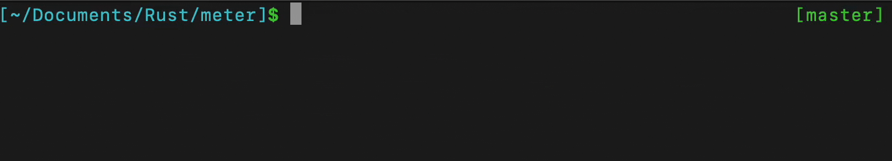

# Meter
[![Crates.io][crates-badge]][crates-url]
[![MIT licensed][mit-badge]][mit-url]

[crates-badge]: https://img.shields.io/crates/v/meter.svg
[crates-url]: https://crates.io/crates/meter
[mit-badge]: https://img.shields.io/badge/license-MIT-blue.svg
[mit-url]: https://github.com/cgburgess/meter/blob/master/LICENSE

This is a very simple command line utility written in Rust for measuring the gain of a microphone. It displays the
values in
[dBFS](https://en.wikipedia.org/wiki/DBFS). This is useful for knowing when a microphone's gain is set to an appropriate level to avoid clipping.

Currently defaults to using the default microphone. Only tested in Mac. Future plans seen in the todos.



## Install

### Clone and Build

Clone the repo and install using Cargo

```bash
$ cargo install --path .
```

### Crates.io

```bash
$ cargo install meter
$ meter
```


## Todo

- [ ] improve ui
- [ ] support more input formats
- [ ] support output monitoring
- [ ] support choosing input/output
- [ ] mono vs stereo?
